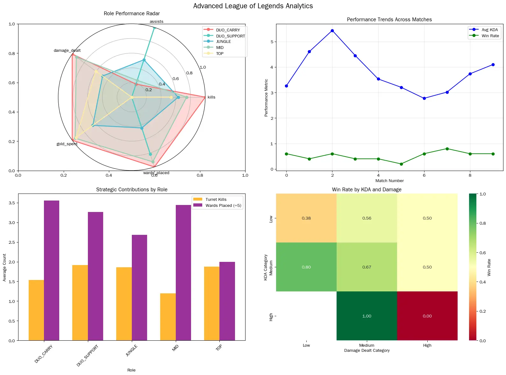
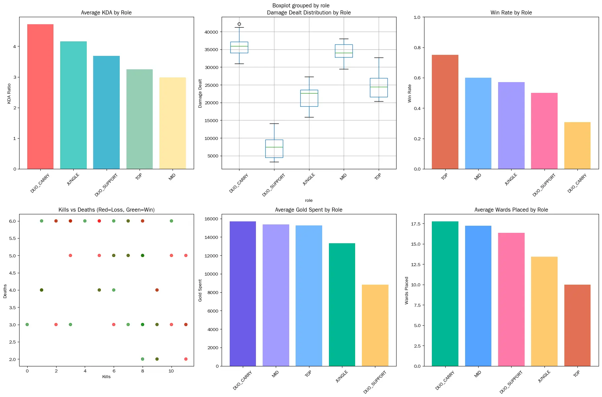

# League of Legends Match Data Analysis

## 📄 Overview
This project analyzes **League of Legends** match data to uncover key gameplay insights.  
The workflow covers **data cleaning**, **exploratory analysis**, and **interactive Power BI dashboard** creation to visualize performance trends and metrics.

The dataset was downloaded from **Kaggle**, and **ChatGPT** was used as a coding assistant for some Python-related tasks.

---

## 🔍 Project Workflow

### 1. Data Collection & Integration
- Downloaded raw match data from Kaggle.
- Gathered multiple CSV files containing match statistics.
- Merged all datasets into a single consolidated file for analysis.

### 2. Data Cleaning & Preprocessing (Python)
- Removed duplicate entries and irrelevant columns.
- Handled missing values.
- Standardized column names and data formats.
- Used ChatGPT to assist with some Python code snippets.

### 3. Exploratory Data Analysis (Python)
- Calculated aggregated statistics such as win rate, kills, deaths, and assists.
- Identified trends and patterns using descriptive statistics and group analysis.

### 4. Interactive Analysis & Dashboard Creation (Power BI)
- Imported the cleaned dataset into Power BI.
- Created multiple interactive visuals to analyze metrics by different dimensions (e.g., team side, champion, game duration).
- Used slicers and filters for dynamic exploration.
- Designed a clean dashboard layout to visualize KPIs such as win rate, average kills/deaths/assists, and match distribution.

---

## 📊 Key Insights
- **Champion Balance:** Certain champions have a significantly higher win rate, suggesting they may be overpowered.
- **Top Kill Champions:** Identified champions with the highest average kills per match.
- **Vision Control Impact:** More wards placed = higher win probability.
- **Team Side Advantage:** Blue side teams win more matches compared to red side teams.
- **Minion Kills Correlation:** Higher CS correlates with higher win rates.
- **Gold Advantage:** Winning teams usually have a higher total gold.
- **ADC Role Performance:** ADC champions often achieve the highest kills.

---

## 🛠 Tools & Technologies
- **Python:** Pandas, NumPy (data cleaning & exploration)
- **Power BI:** Data visualization & dashboard design
- **Jupyter Notebook:** Analysis and documentation
- **Kaggle:** Dataset source
- **ChatGPT:** Coding assistance

---

## 📷 Dashboard Screenshots
Below are some sample visuals from the Power BI dashboard:

  
  

---

## 📌 How to Use
1. Download the repository.
2. Open the Jupyter Notebook to view the Python data cleaning & analysis steps.
3. Open the Power BI file (`.pbix`) to interact with the dashboard.

---

## 📜 License
This project is for educational purposes only.  
League of Legends is a trademark of Riot Games, Inc.  
This analysis is **not affiliated with or endorsed by Riot Games**.
